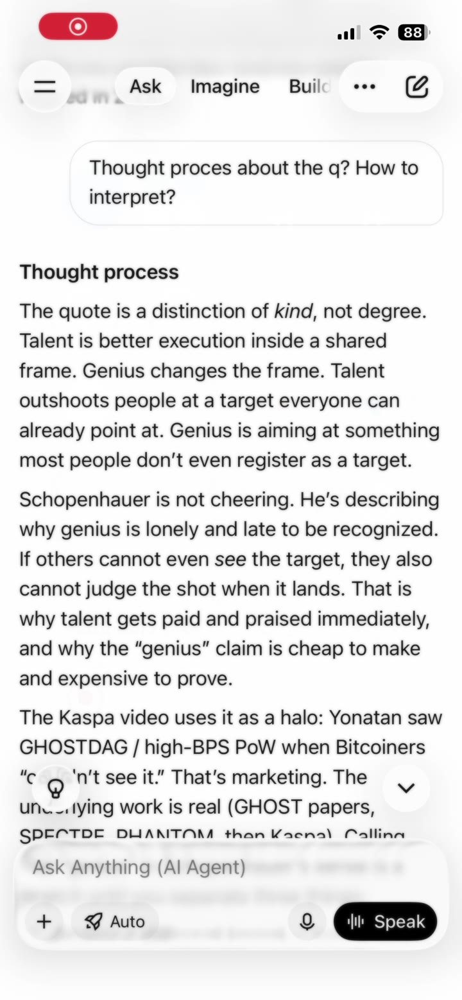
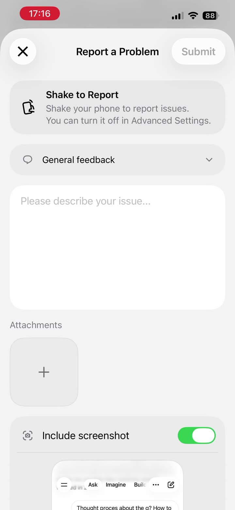
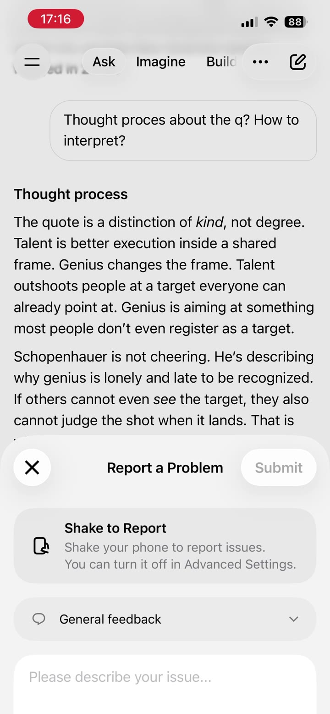

# feedback-stp-delusional

Repo: https://github.com/STP-KAS/feedback-stp-delusional

Grok / X UX observations collected with Grok between **19 Jul 2026** and **5 Sep 2026**.

**This is not a manifesto.** These are things one user noticed. Not a pioneer. Not a genius. Suggestions. Up for debate.

- Author: stp (`@stppstp` on X, GitHub `STP-KAS`)
- Packaged: 14 Sep 2026
- Tone requested by author: honest, not self-important
- Grok Build: paste [`GROK_BUILD_PROMPT.md`](GROK_BUILD_PROMPT.md). Chat memory for Build: [`CHAT_CONTEXT.md`](CHAT_CONTEXT.md)

---

## How to read this

- Observations only.
- If something is already fixed, good.
- Evidence that still exists in this folder is under [Media](#media).
- July 2026 pinned-chat / sync screenshots were referenced in chat but were **not attached again** in the later thread. Only the **5 Sep 2026 Shake-to-Report** recording is on disk here.

---

## 1. Pinned chats

**Observed**

- Pinned chats get pushed down when new chats are created.
- Requires manual re-pinning.
- Inconsistency: Expand button vs History click on grok.com desktop.

**Suggestion**

- Dedicated **Pinned Chats** section at the very top, that stays at the top.

**Evidence**

- Originally sent with 3 screenshots + video. Those files are **not** in `media/` (not re-attached).

---

## 2. History navigation + search in this chat

**Observed**

- Opening a chat already jumps to the bottom. That part is fine.

**Suggestion**

- Always show both arrows: ↑ Jump to Top and ↓ Jump to Bottom.
- If you are already at top/bottom, clicking can do nothing. Fine.
- Add a labeled **Search in this chat** control that searches **only the current conversation**.

**Note from stp**

- Ctrl+F exists on Windows. Not everybody knows that. A visible in-chat search button is more discoverable.

---

## 3. Cross-platform sync

**Observed**

- App → grok.com: real time.
- grok.com → iOS app: needs close + reopen.

**Evidence**

- Originally supported with a screen recording. File **not** in `media/` (not re-attached).

---

## 4. Sidebar icons / labels

**Observed**

- Icons only. Text on hover.

**Suggestion**

- Show text labels by default, or add a toggle.
- If labels are added, **icon and text** should both be the hit target (the whole row is a link).
- Also offer **text only, no icons**. Clean icons are not always the most usable.

---

## 5. Product naming / App Store clarity (high priority at the time)

**Observed**

- Messaging can send people to the wrong product when they want coding / agent work.

**Suggestion**

- Keep promoting the strong model.
- Separate products in language:
  - **Grok** → general assistant
  - **Grok Build** → coding agent
- Example line: *Grok 4.5 is our smartest model. For serious coding and agentic work, use Grok Build.*

**Later note (Sep 2026 check)**

- Grok Build became a real separate product. Naming confusion then grew to three names (Grok, Grok Build, Grok Bot). The original point still stands: say which tool is for what.

---

## 6. X profiles update (positive)

Noticed earlier. Later really appreciated it.

> Great success. Love it. Well done to the team. This is how it is done. Really good.

---

## 7. Shake to Report (iOS) — 5 Sep 2026

**Observed**

- A bump, putting the phone on a table, throwing it on the bed, or setting it down while waiting for a reply opens **Report a Problem**.
- Motion is a bad signal for “I want to file a bug.”

**Suggestion (up for debate)**

- Shake to Report should not be on by default, or the gesture should be removed.
- Reporting is fine. A button is enough. Movement should not pop a sheet.

**stp on himself**

- Hit the popup many times and did not turn it off.
- Did not read the sheet. Did not ask how to stop it.
- Off switch was already in Advanced Settings. That part is on the user.
- Still does not see the value of shake-as-default.

**Evidence in this folder**

| File | What it shows |
| --- | --- |
| [media/shake-to-report-2026-09-05.mp4](media/shake-to-report-2026-09-05.mp4) | 20.5s iPhone recording: chat → Report a Problem sheet after movement, repeatedly |
| [media/shake-frame-02.jpg](media/shake-frame-02.jpg) | Grok iOS chat (Ask / Imagine / Build) with thought-process answer |
| [media/shake-frame-04.jpg](media/shake-frame-04.jpg) | Report a Problem + Shake to Report + Include screenshot |
| [media/shake-frame-12.jpg](media/shake-frame-12.jpg) | Sheet sliding over the live chat after a bump |
| [media/shake-frame-19.jpg](media/shake-frame-19.jpg) | Same overlay again later in the clip |

Full 1 fps extract: `media/shake-frame-01.jpg` … `media/shake-frame-20.jpg`

### Stills

---

## Missing media (honest)

These were described in July 2026 chats and are **not** in this attachment set:

- 3 screenshots + video for pinned chats
- screen recording for grok.com → iOS sync

Drop them in `media/` if they still exist on the phone, then commit.

---

## GitHub

Public repo: https://github.com/STP-KAS/feedback-stp-delusional

Text is in the repo. The Shake-to-Report **video is 16MB**. If `media/` is missing on GitHub, upload it from the local pack.

July 2026 pinned-chat / sync recordings were never re-attached. Do not fake them.
